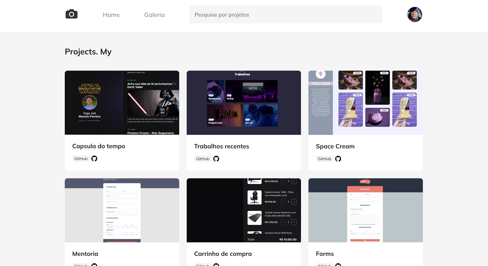

<h1 align="center"> Foto Blog</h1>

Página de uma site de projetos criado por Marcelo. Projeto criado durante o curso Explorer promovido pela
 <a href="https://rocketforms.typeform.com/to/fPcSmBp9#referral_id=f28d3c70-a961-42b9-9b49-ac3686ea0afc" target="_blank"  >Rocketseat.

  <a href="#-tecnologias">Tecnologias</a>&nbsp;&nbsp;&nbsp;|&nbsp;&nbsp;&nbsp;
  <a href="#-projeto">Projeto</a>&nbsp;&nbsp;&nbsp;|&nbsp;&nbsp;&nbsp;
  <a href="#-layout">Layout</a>&nbsp;&nbsp;&nbsp;|&nbsp;&nbsp;&nbsp;
  <a href="#memo-licença">Licença</a>

  

 

  

## 🚀 Tecnologias

Esse projeto foi desenvolvido com as seguintes tecnologias:

- HTML
- CSS
- Git e Github
- Figma

 

## 💻 Projeto

Bem-vindo ao repositório FotoBlog GitHub!

FotoBlog é um projeto que apresenta um site para compartilhamento e exibição de projetos fotográficos. Ele fornece uma plataforma para os fotógrafos mostrarem seu trabalho e se conectarem com uma comunidade de Dev por todo o mundo.

Características
O site FotoBlog oferece os seguintes recursos:

Navegação : O site inclui uma barra de navegação com links para a página inicial e a seção da galeria, permitindo que os usuários naveguem facilmente entre as diferentes seções do site.

Pesquisa : o site inclui uma funcionalidade de pesquisa que permite aos usuários pesquisar projetos fotográficos específicos inserindo palavras-chave.

Vitrine de Projetos : A seção principal do site é dedicada à apresentação de projetos fotográficos. Cada projeto é apresentado como uma figura com uma imagem e detalhes do projeto, incluindo o nome do projeto, um link para o repositório GitHub e tags.

Design responsivo : o site foi projetado para ser totalmente responsivo, proporcionando uma experiência de visualização ideal em uma variedade de dispositivos e tamanhos de tela.

 

🔗 O projeto pode ser acessado através do [GitHub](https://github.com/f18Marcelo/P6-S3-FotoBlog.git)

 

## 🔖 Layout

Você pode visualizar o layout do projeto através [DESSE LINK](https://www.figma.com/file/ZBB12qkkLOw7jP4AGIV2MQ/Explorer-Recriar-My?type=design&node-id=0-1&t=QAI1hrgyuw7ns5HW-0). É necessário ter conta no [Figma](https://figma.com) para acessá-lo.

## :memo: Licença

Esse projeto está sob a licença MIT.

---

Faça Networking e vamos nos conectar através [Linkedin](https://www.linkedin.com/in/marcello-ferreira-b520531a8/) e [Instagram](https://www.instagram.com/marcello_consorcios)